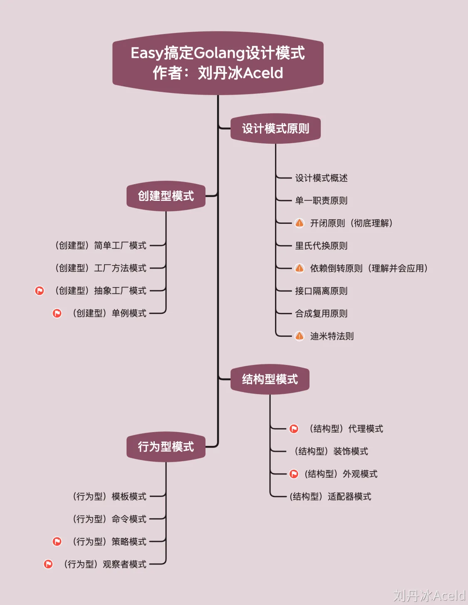
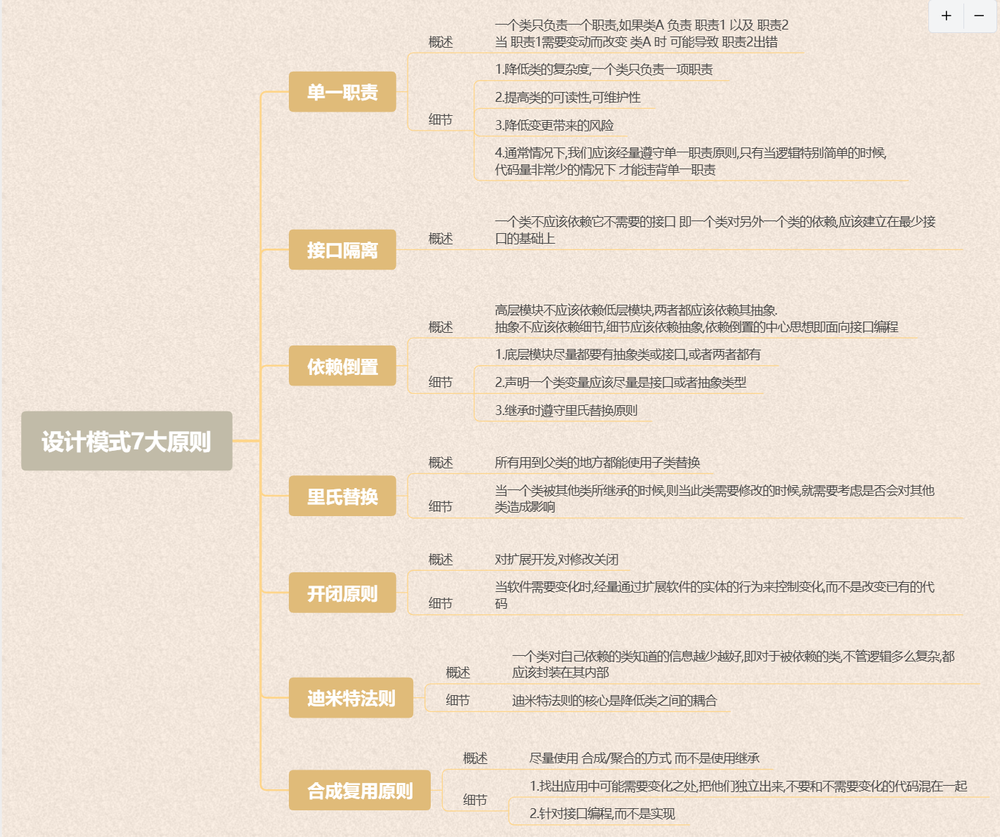

[toc]

参考：【[Easy 搞定 Golang设计模式](https://www.yuque.com/aceld/lfhu8y)】

# 23种设计模式

冰叔的视频里只涉及上图中的模式，其中一些模式案例很有意思，特别是观察者模式的武林大乱斗

总表

|      模式类型      |           模式名称           | 作用                                                                                                                                                                                         |
| :----------------: | :--------------------------: | -------------------------------------------------------------------------------------------------------------------------------------------------------------------------------------------- |
|     创建型模式     |   单例模式 ★★★★☆   | 是保证一个类仅有一个实例，并提供一个访问它的全局访问点。                                                                                                                                     |
| Creational Pattern | 简单工厂模式 ★★★☆☆ | 通过专门定义一个类来负责创建其他类的实例，被创建的实例通常都具有共同的父类。                                                                                                                 |
|       （6）       | 工厂方法模式 ★★★★★ | 定义一个创建产品对象的工厂接口，将实际创建工作推迟到子类中。                                                                                                                                 |
|                    | 抽象工厂模式 ★★★★★ | 提供一个创建一系列相关或者相互依赖的接口，而无需指定它们具体的类。                                                                                                                           |
|                    |   原型模式 ★★★☆☆   | 用原型实例指定创建对象的种类，并且通过拷贝这些原型创建新的对象。                                                                                                                             |
|                    |  建造者模式 ★★☆☆☆  | 将一个复杂的构建与其表示相分离，使得同样的构建过程可以创建不同的表示。                                                                                                                       |
|                    |                              |                                                                                                                                                                                              |
|     结构型模式     |  适配器模式 ★★★★☆  | 将一个类的接口转换成客户希望的另外一个接口。使得原本由于接口不兼容而不能一起工作的那些类可以一起工作。                                                                                       |
| Structural Pattern |   桥接模式 ★★★☆☆   | 将抽象部分与实际部分分离，使它们都可以独立的变化。                                                                                                                                           |
|       （7）       |   组合模式 ★★☆☆☆   | 将对象组合成树形结构以表示“部分--整体”的层次结构。使得用户对单个对象和组合对象的使用具有一致性。                                                                                           |
|                    |   装饰模式 ★★★☆☆   | 动态的给一个对象添加一些额外的职责。就增加功能来说，此模式比生成子类更为灵活。                                                                                                               |
|                    |   外观模式 ★★★★★   | 为子系统中的一组接口提供一个一致的界面，此模式定义了一个高层接口，这个接口使得这一子系统更加容易使用。                                                                                       |
|                    |   享元模式 ★☆☆☆☆   | 以共享的方式高效的支持大量的细粒度的对象。                                                                                                                                                   |
|                    |   代理模式 ★★★★☆   | 为其他对象提供一种代理以控制对这个对象的访问。                                                                                                                                               |
|                    |                              |                                                                                                                                                                                              |
|     行为型模式     |  职责链模式 ★★☆☆☆  | 在该模式里，很多对象由每一个对象对其下家的引用而连接起来形成一条链。请求在这个链上传递，直到链上的某一个对象决定处理此请求，这使得系统可以在不影响客户端的情况下动态地重新组织链和分配责任。 |
| Behavioral Pattern |   命令模式 ★★★★☆   | 将一个请求封装为一个对象，从而使你可用不同的请求对客户端进行参数化；对请求排队或记录请求日志，以及支持可撤销的操作。                                                                         |
|       （11）       |  解释器模式 ★☆☆☆☆  | 如何为简单的语言定义一个语法，如何在该语言中表示一个句子，以及如何解释这些句子。                                                                                                             |
|                    |  迭代器模式 ★☆☆☆☆  | 提供了一种方法顺序来访问一个聚合对象中的各个元素，而又不需要暴露该对象的内部表示。                                                                                                           |
|                    |  中介者模式 ★★☆☆☆  | 定义一个中介对象来封装系列对象之间的交互。中介者使各个对象不需要显示的相互调用 ，从而使其耦合性松散，而且可以独立的改变他们之间的交互。                                                      |
|                    |  备忘录模式 ★★☆☆☆  | 是在不破坏封装的前提下，捕获一个对象的内部状态，并在该对象之外保存这个状态。                                                                                                                 |
|                    |  观察者模式 ★★★★★  | 定义对象间的一种一对多的依赖关系，当一个对象的状态发生改变时，所有依赖于它的对象都得到通知并被自动更新。                                                                                     |
|                    |   状态模式 ★★☆☆☆   | 对象的行为，依赖于它所处的状态。                                                                                                                                                             |
|                    |   策略模式 ★★★★☆   | 准备一组算法，并将每一个算法封装起来，使得它们可以互换。                                                                                                                                     |
|                    | 模板方法模式 ★★★☆☆ | 得子类可以不改变一个算法的结构即可重定义该算法的某些特定步骤。                                                                                                                               |
|                    |  访问者模式 ★☆☆☆☆  | 表示一个作用于某对象结构中的各元素的操作，它使你可以在不改变各元素的类的前提下定义作用于这些元素的新操作。                                                                                   |

## 七大原则

### 单一职责原则

### 开闭原则

### 里氏代换原则

### 依赖倒置原则

### 接口隔离原则

### 合成复用原则

### 迪米特原则

## 创建型模式

### 单例模式

### 简单工厂模式

### 工厂方法模式

### 抽象工厂模式

### 原型模式

### 建造者模式

## 结构型模式

### 代理模式

### 装饰器模式

### 适配器模式

### 外观模式

### 组合模式

### 享元模式

### 桥接模式

## 行为型模式

### 模板方法模式

### 命令模式

### 策略模式

### 观察者模式

### 访问者模式

### 职责链模式

### 中介者模式

### 迭代器模式

### 解释器模式

### 状态模式

### 备忘录模式
